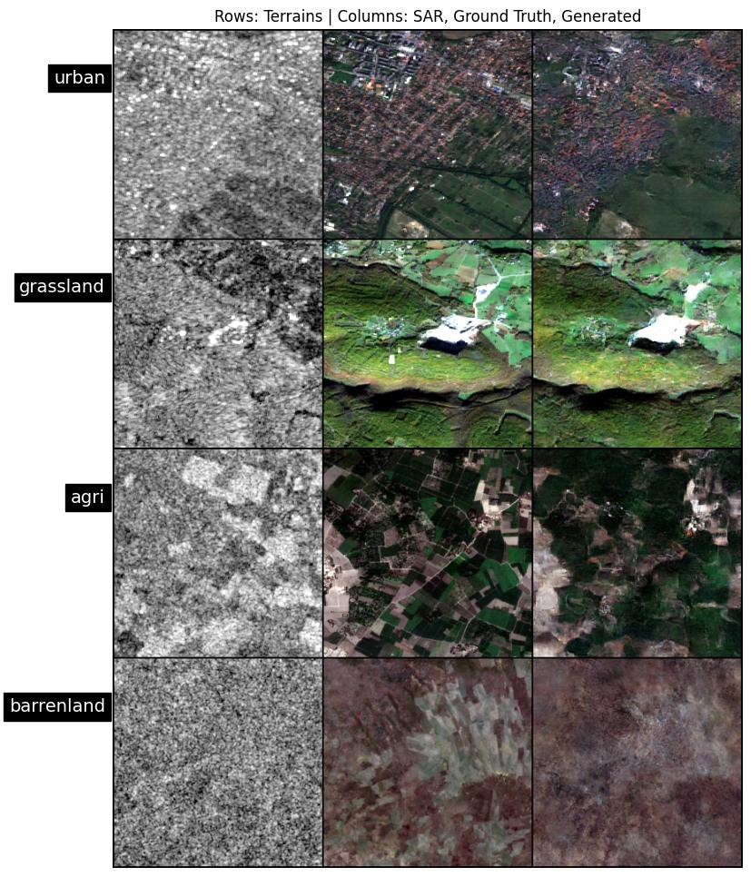

# SAR-to-RGB: Terrain-Aware Image Translation

<p align="center">
  
</p>
The image illustrates how accurate the model is in generating colored images for varied input SAR Images. Randomly the images are taken from 4 different terrains, shuffled and sent to the model for prediction.
The second column represents the ground truth images of all the input SAR Images and the third column represents the images which are generated by the model.

## 🛰️ Overview

This project implements a deep learning system for translating Synthetic Aperture Radar (SAR) imagery into realistic RGB images. Using a conditional GAN architecture with terrain-specific optimization, the model can generate colorized versions of SAR data that closely resemble aerial/satellite photography.

### Key Metrics Achieved in validation set:
- **FID Score**: 108.18 
- **SSIM**: 0.36
- **PSNR**: 19 dB
- **IS** : 3.07


## 🔍 Features

- **Terrain-Conditional Image Translation**: Generates RGB images conditioned on terrain classification
- **Multi-Terrain Support**: Urban, Grassland, Agricultural, and Barren Land domains
- **UNet-Based Generator**: Advanced encoder-decoder architecture with skip connections
- **PatchGAN Discriminator**: For high-quality local texture assessment
- **Performance Metrics**: FID, SSIM, PSNR, and Inception Score (IS) evaluation

## 🏗️ Architecture

The system consists of three key components:

1. **Terrain Classifier**: ResNet34-based model that identifies land cover type from SAR imagery
2. **Generator**: UNet architecture conditioned on terrain features
3. **Discriminator**: PatchGAN for realistic texture assessment

<p align="center">
  
</p>

## 📊 Results

Our model achieves state-of-the-art results in SAR-to-RGB conversion across multiple terrain types. By conditioning on terrain classification, the model produces more accurate and visually coherent colorized images than terrain-agnostic approaches.

## 🚀 Getting Started

### Requirements

```
torch>=1.8.0
torchvision>=0.9.0
numpy
matplotlib
Pillow
tqdm
scikit-image
```


## 💻 Usage

### Testing with Your Own Images

Run the inference script with your SAR image

The script will:
1. Prompt you for a SAR image path
2. Once the SAR Image is received, i's terrain will be classified by the ResNet34 Model.
3. The Unet based  Generator will receive the terrain class and based on the terrain it will generate a colorized version
4. Display and save the results


## 📁 Dataset Organization

The dataset should be organized as follows:

```
Dataset/
├── urban/
│   ├── SAR/
│   └── Color/
├── grassland/
│   ├── SAR/
│   └── Color/
├── agri/
│   ├── SAR/
│   └── Color/
└── barrenland/
    ├── SAR/
    └── Color/
```

## 📈 Performance Analysis

We evaluated our model using multiple metrics:
- **FID** (Fréchet Inception Distance): Measures similarity between generated and real images
- **SSIM** (Structural Similarity Index): Evaluates structural preservation
- **PSNR** (Peak Signal-to-Noise Ratio): Assesses pixel-level reconstruction quality
- **IS** (Inception Score): Measures diversity and quality of generated samples


