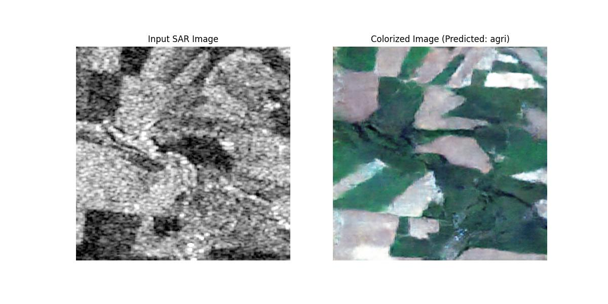

# Terrain-Aware Synthetic Radar Image (SAR) to RGB Colorization through Automated Terrain Classification using Conditional Generative Adversarial Network (GAN)

## 🛰️ Overview

This project implements a deep learning system for translating Synthetic Aperture Radar (SAR) imagery into realistic RGB images. A pretrained ResNet34 Model is finetuned to classify different terrains for SAR Images. Integrating the ResNet34 Model with a conditional Generative Adversarial Network (GAN) architecture, the model can generate colorized versions of SAR data that closely resemble aerial/satellite photography.


## 🔍 Features

- **Terrain-Conditional Image Translation**: Generates RGB images conditioned on terrain classification
- **Multi-Terrain Support**: Urban, Grassland, Agricultural, and Barren Land domains
- **UNet-Based Generator**: Advanced encoder-decoder architecture with skip connections
- **PatchGAN Discriminator**: For high-quality local texture assessment
- **Performance Metrics**: FID, SSIM, PSNR, and Inception Score (IS) evaluation

## 🏗️ Architecture

The system consists of three key components:

1. **Terrain Classifier**: ResNet34-based model that identifies land cover type from SAR imagery
2. **Generator**: UNet architecture conditioned on terrain features
3. **Discriminator**: PatchGAN for realistic texture assessment

<p align="center">
  
</p>

## 🏗️ Training Setup:
- **Framework** : PyTorch
- **GPU** : NVIDIA Geforce RTX 4060
- **Epochs** : 140
- **Batch Size** : 8
- **Learning Rate** : 2e-4
- **Mixed Precision** : Enabled

## 🏗️ Dataset:
The dataset consisted of 4 terrains namely, urban, grassland, barrenland and agri. Each terrain had 2 different folders, one for the SAR Images and the other included the Corresponding color images of it.
The dataset was split in a 80/20 manner during training.

## 🚀 Getting Started

### Requirements

```
torch>=1.8.0
torchvision>=0.9.0
numpy
matplotlib
Pillow
tqdm
scikit-image
```

  


## 📊 Results

Our model achieves state-of-the-art results in SAR-to-RGB conversion across multiple terrain types. By conditioning on terrain classification, the model produces more accurate and visually coherent colorized images than terrain-agnostic approaches.
We evaluated our model using multiple metrics:
- **FID** (Fréchet Inception Distance): Measures similarity between generated and real images
- **SSIM** (Structural Similarity Index): Evaluates structural preservation
- **PSNR** (Peak Signal-to-Noise Ratio): Assesses pixel-level reconstruction quality
- **IS** (Inception Score): Measures diversity and quality of generated samples

Classification accuracy achieved by the ResNet34 Model : **99.94%**
### Key Metrics Achieved by the GAN Model:
- **FID Score**: 108.18 
- **SSIM**: 0.36
- **PSNR**: 19 dB
- **IS** : 3.07


<p align="center">
  
</p>
 The above SAR Images are taken from 4 different terrains, shuffled and sent to the model for prediction.
The second column represents the ground truth images of all the input SAR Images and the third column represents the images which are generated by the model.
<br>
<p align="center">
  
</p>
SAR Input Image provided by the user and the corresponding output colorized image provided by our model.


